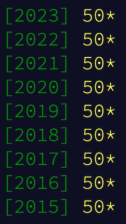

# Advent of Code C++23

Modern C++ solutions to every [Advent of Code](https://adventofcode.com/2015/events) problem.
This is not a "best practices C++" repository, but rather a casual sandbox for testing how new language and library features play along with each other.
